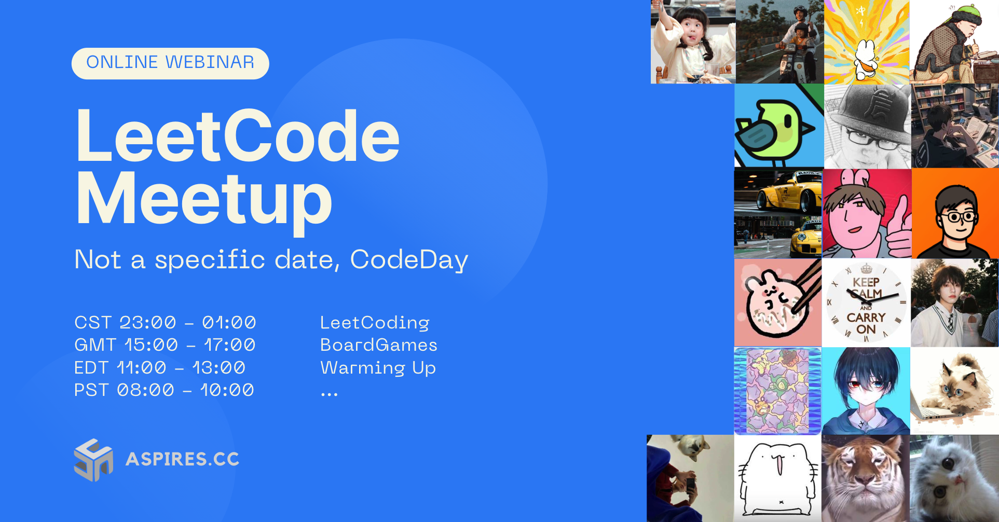

# LeetCode Workshop

Welcome to the LeetCode Workshop repository! This repository is meant to support 👨‍💻(currently unnamed) LeetCode online workshop meetups with friends, where everyone can work together on solving LeetCode problems and improve your coding skills.

## About
In this LeetCode Workshop, our goal is to provide a collaborative environment for participants to solve LeetCode problems and learn from each other. This repository will serve as a central hub for sharing code solutions, discussing problem-solving approaches, and organizing meetup sessions.

## Getting Started
To participate in the LeetCode Workshop, follow these steps if you willing to:

1. [Fork](https://docs.github.com/en/github/getting-started-with-github/fork-a-repo) this repository.
2. [Clone](https://docs.github.com/en/github/creating-cloning-and-archiving-repositories/cloning-a-repository) the forked repository to your local machine.
3. Install any necessary dependencies or programming language/tools required for solving LeetCode problems.
4. Create a new branch in your local repository for problems you are working on.
5. Solve the LeetCode problems and implement your solutions within your branch.
6. Push your branch to your forked repository.
7. [Create a Pull Request](https://docs.github.com/en/github/collaborating-with-issues-and-pull-requests/about-pull-requests) to merge your changes into the main repository.

Once your Pull Request is submitted, other participants can review your solutions, provide feedback, and suggest improvements. Feel free to discuss problem-solving strategies, share coding techniques, or ask questions in the Pull Request discussions.

## Contributing
Contributions to this project are welcome! If you would like to contribute to the LeetCode Workshop, please follow our [Contribution Guidelines (I am working on it)](CONTRIBUTING.md) for instructions on how to get started.

## License
This project is licensed under the [MIT License](LICENSE). Feel free to use, modify, and distribute the code and resources in this repository for your own LeetCode Workshop meetups.

## Naming Conventions
Please follow the naming conventions below when creating new files or folders in this repository:

1. **File Names**: Use kebab case (all lowercase with hyphens) for file names of specific programming languages such as Python, and C++. For example: `two-sum.py`, `integer-to-roman.cpp`. Use Pascal case (first letter of each word capitalized) for file names of general programming languages such as Java, and JavaScript. For example: `TwoSum.java`, `IntegerToRoman.js`.
2. **Folder Names**: Use kebab case for folder names as well. For example: `array-problems`, `string-problems`.
3. **Readme Files**: Use `README.md` (all uppercase) for the main README file of each problem or topic folder.

Feel free to customize and modify the README.md file as per your needs.